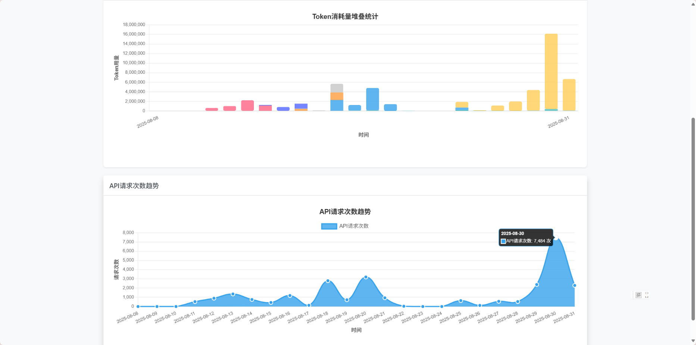

# 智谱AI费用分析应用

一个用于可视化智谱AI开放平台费用明细数据的本地部署网页应用。该应用专门针对智谱AI平台的资源包Token使用量分析，提供数据可视化和分析功能。





## 使用方法

### 启动应用

在项目根目录下运行：

```bash
./start.sh
```

或者手动启动：

```bash
python3 -m http.server 8000
```

## 开源许可证

MIT License
